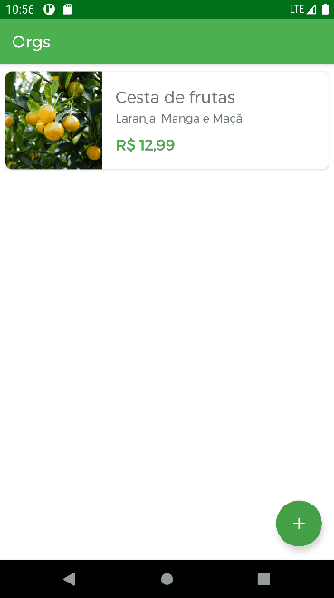

# Orgs

App de simulação para o curso de personalização de UI no Android com Kotlin Escola Alura-Cursos

## 🔨 Funcionalidades do projeto

O App lista produtos com imagem, título, descrição e valor. Também, é possível cadastrar produtos. Todo armazenamento é mantido em memória do App, portanto, ao finalizar o App as informações são perdidas.

## ✔️ Técnicas e tecnologias utilizadas

As técnicas e tecnologias utilizadas pra isso são:

- `CardView`: container para apresentar cada produto na lista de produtos
- `RecyclerView`: listagem das produtos
- `ConstraintLayout`: ViewGroup padrão para implementar todos os layouts
- `ImageView`: View para apresentar imagens no App
- `Coil`: carregar imagens via requisição HTTP
- `View Binding`: busca de views do layout de forma segura
- `AlertDialog`: Exibição de formulário para carregar novas imagens do produto
- `Fontes personalizadas`: configuração para adicionar novas fontes
- `Extension functions`: adicionar comportamentos em outras classes para reutilizá-los
- `Personalização de tema`: modificação de cores para o tema do App

Tela de detalhes do produto

## 📁 Acesso ao projeto

Você pode clonar com git clone git@github.com:andrehahn05/Orgs.git
Você pode pode [baixar-lo](https://github.com/andrehahn05/Orgs/archive/refs/heads/main.zip) zip

O Android Studio deve executar algumas tasks do Gradle para configurar o projeto, aguarde até finalizar. Ao finalizar as tasks, você pode executar o App 🏆 
